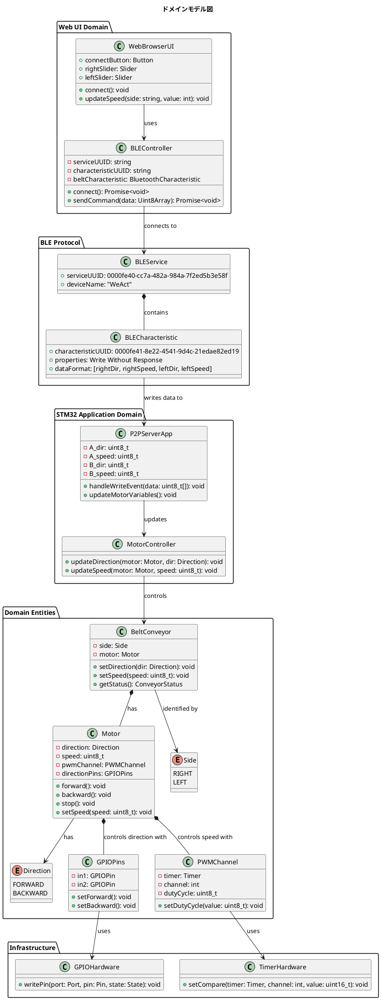
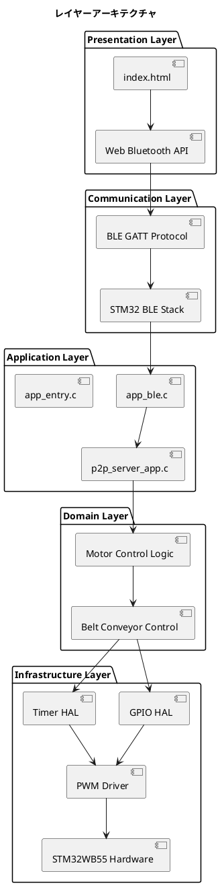
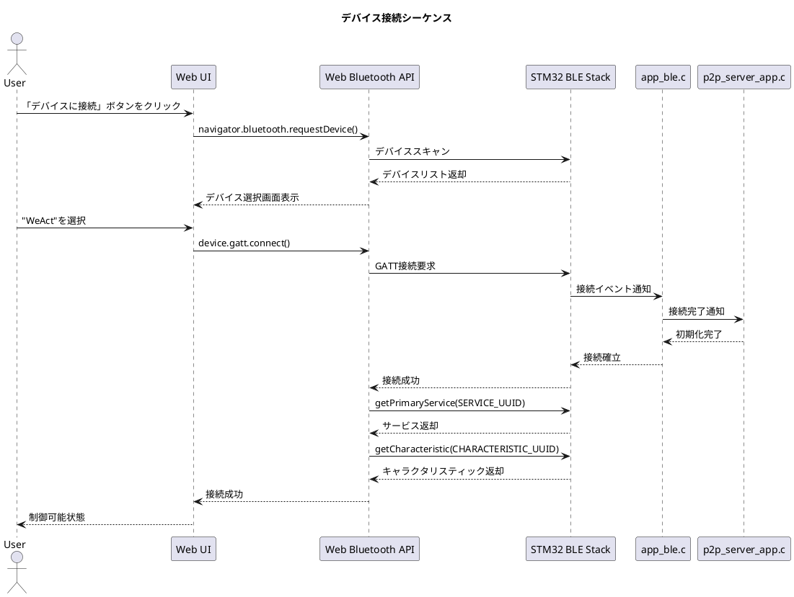
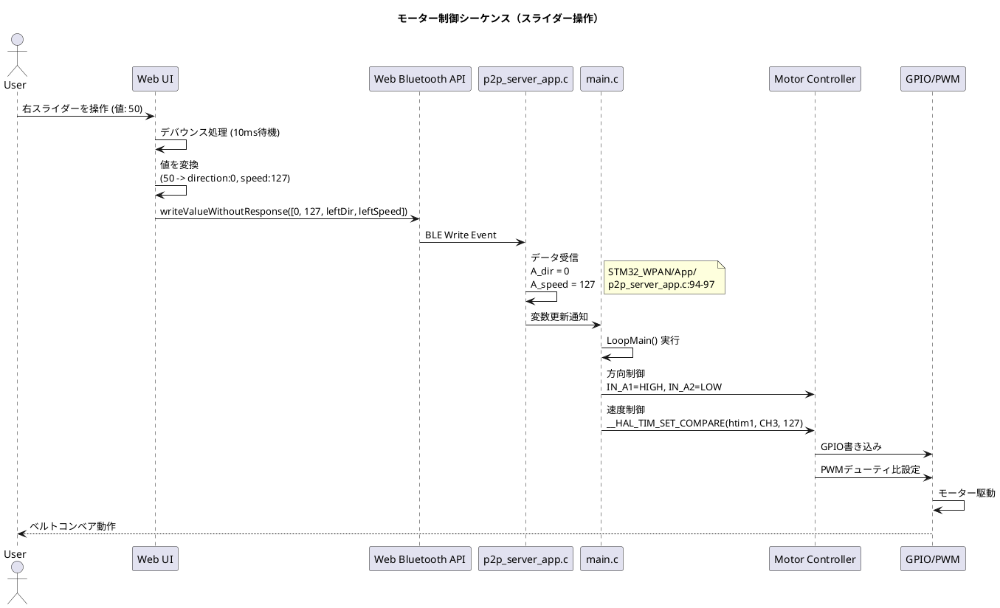
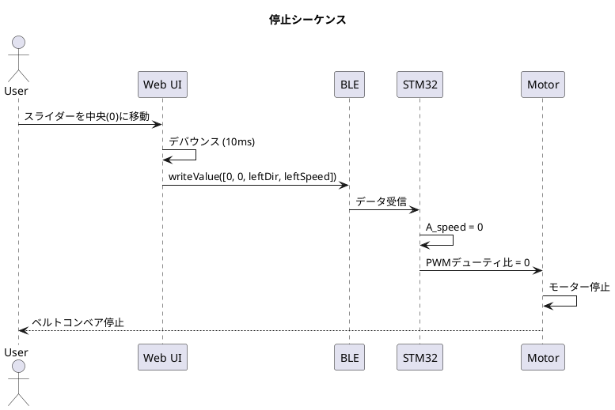
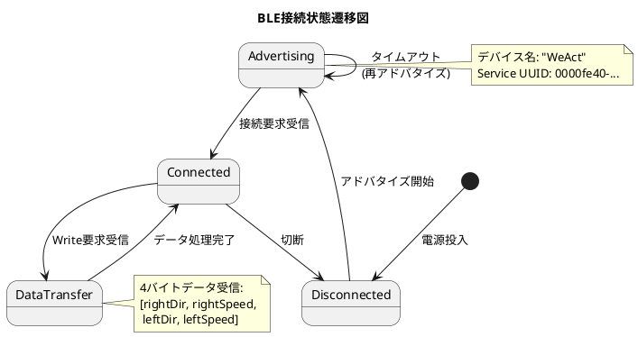
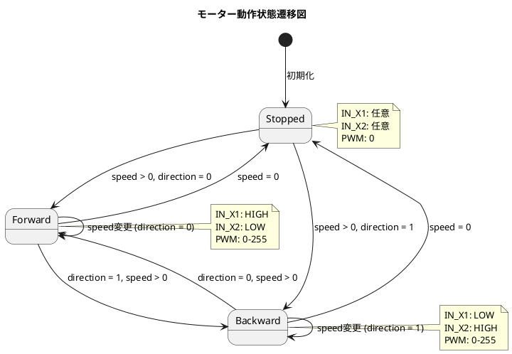
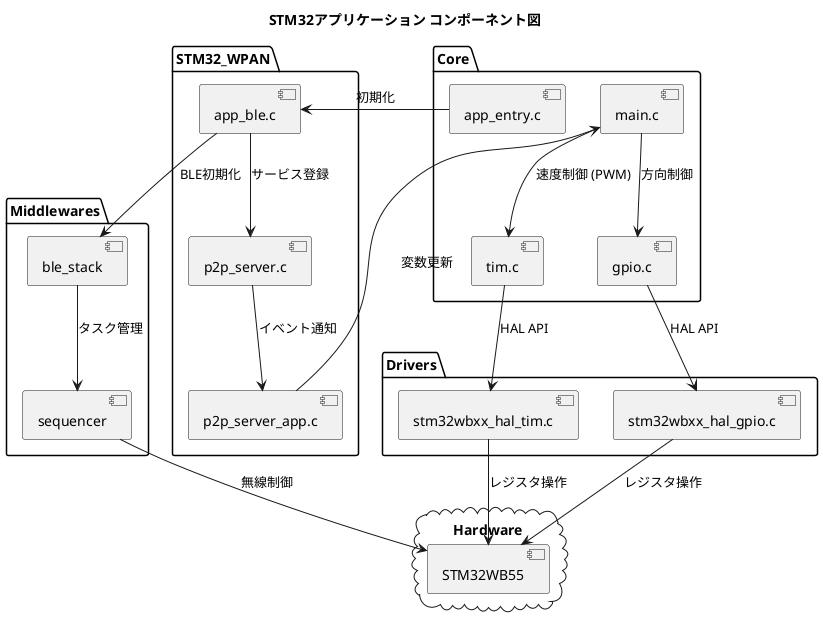
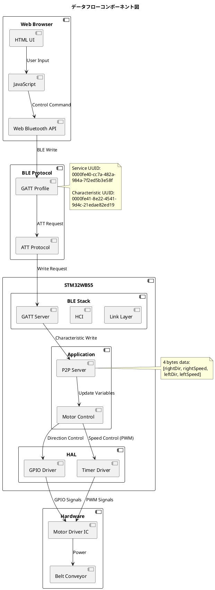

# ドメインモデル - STM32RC BLE Belt Conveyor Controller

このドキュメントでは、STM32RC BLE Belt Conveyor Controllerのドメインモデルを定義します。

## 目次

- [システムコンテキスト図](#システムコンテキスト図)
- [ドメインモデル図](#ドメインモデル図)
- [レイヤーアーキテクチャ](#レイヤーアーキテクチャ)
- [シーケンス図](#シーケンス図)
- [状態遷移図](#状態遷移図)
- [コンポーネント図](#コンポーネント図)

---

## システムコンテキスト図

システム全体の境界とアクターを示します。

```plantuml
@startuml
!include https://raw.githubusercontent.com/plantuml-stdlib/C4-PlantUML/master/C4_Context.puml

title システムコンテキスト図 - STM32RC BLE Belt Conveyor Controller

Person(user, "ユーザー", "ベルトコンベアを操作したい人")
System(webapp, "Web UI", "Web Bluetooth APIを使用した制御画面")
System_Boundary(stm32_system, "STM32WB55システム") {
    System(stm32, "STM32WB55", "BLE対応マイコン")
}
System(motorDriver, "モータードライバ", "TB6612FNGなど")
System(conveyor, "ベルトコンベア", "左右2系統の搬送装置")

Rel(user, webapp, "スライダー操作", "タッチ/マウス")
Rel(webapp, stm32, "制御コマンド送信", "BLE")
Rel(stm32, motorDriver, "PWM/GPIO信号", "電気信号")
Rel(motorDriver, conveyor, "モーター駆動", "電力")

@enduml
```


---

## ドメインモデル図

システムの中核となるドメインオブジェクトとその関係を示します。




---

## レイヤーアーキテクチャ

システムのレイヤー構造を示します。




---

## シーケンス図

### 1. デバイス接続シーケンス




### 2. モーター制御シーケンス




### 3. 停止シーケンス




---

## 状態遷移図

### BLE接続状態




### モーター動作状態




---

## コンポーネント図

### STM32アプリケーションコンポーネント




### データフローコンポーネント




---

## ドメイン用語集

### エンティティ

| 用語 | 説明 |
|------|------|
| **BeltConveyor** | ベルトコンベアを表すドメインエンティティ。左右2つ存在する。 |
| **Motor** | DCモーターを制御するエンティティ。方向と速度を持つ。 |
| **Direction** | モーターの回転方向（前進/後進）を表す値オブジェクト。 |
| **Speed** | モーターの速度（0-255）を表す値オブジェクト。 |

### サービス

| 用語 | 説明 |
|------|------|
| **MotorController** | モーターを制御するドメインサービス。GPIO/PWMを操作する。 |
| **BLEController** | BLE通信を管理するアプリケーションサービス。 |
| **P2PServerApp** | BLE P2Pサービスのアプリケーション層実装。 |

### 値オブジェクト

| 用語 | 説明 |
|------|------|
| **PWMDutyCycle** | PWMのデューティ比（0-255）。 |
| **GPIOState** | GPIOピンの状態（HIGH/LOW）。 |
| **BLECharacteristicData** | BLEで送信される4バイトのデータ。 |

### インフラストラクチャ

| 用語 | 説明 |
|------|------|
| **GPIOHardware** | STM32のGPIOペリフェラルを操作するインフラ層。 |
| **TimerHardware** | STM32のTimerペリフェラルを操作するインフラ層。 |
| **BLEStack** | STM32WB BLEプロトコルスタック。 |

---

## ユビキタス言語（Ubiquitous Language）

プロジェクト内で共通に使用される用語の定義：

- **ベルトコンベア (Belt Conveyor)**: 物体を搬送する装置。左右2系統存在する。
- **右ベルト / A系統**: 右側のベルトコンベア。TIM1_CH3でPWM制御。
- **左ベルト / B系統**: 左側のベルトコンベア。TIM2_CH1でPWM制御。
- **前進 (Forward)**: ベルトが順方向に動作する状態。direction = 0。
- **後進 (Backward)**: ベルトが逆方向に動作する状態。direction = 1。
- **速度 (Speed)**: モーターの回転速度。0（停止）〜255（最大速度）。
- **デバウンス (Debounce)**: 連続した入力を一定時間後に1回だけ処理する仕組み。Web UI側で10ms。
- **Write Without Response**: BLE通信方式の一つ。応答を待たずに書き込む。リアルタイム制御に適している。
- **P2P (Peer to Peer)**: STM32WBのBLEサンプルアプリケーション名。カスタムサービスを実装する際のベース。
- **STANDBY**: モータードライバのスタンバイ制御ピン。HIGHで動作可能。
- **IN_X1, IN_X2**: モータードライバの方向制御ピン。組み合わせで前進/後進を切り替え。

---

## アーキテクチャ上の制約

### 技術的制約

1. **BLE通信**
   - 1対1接続のみサポート
   - データサイズ: 4バイト固定
   - 通信方式: Write Without Response

2. **PWM制御**
   - 分解能: 8ビット (0-255)
   - 使用タイマー: TIM1_CH3 (右), TIM2_CH1 (左)

3. **GPIO制御**
   - 方向制御: 2ピン/モーター
   - スタンバイ制御: 共通1ピン

### ビジネス制約

1. **安全性**
   - 接続切断時は自動的に停止すべき（要実装）
   - 最大速度制限が必要な場合がある

2. **リアルタイム性**
   - スライダー操作からモーター動作まで100ms以内の応答が望ましい

3. **消費電力**
   - BLEアドバタイジング間隔を調整して省電力動作を実現

---

## まとめ

このドメインモデルは、STM32RC BLE Belt Conveyor Controllerの以下の側面を明確にします：

1. **責務の分離**: プレゼンテーション層、アプリケーション層、ドメイン層、インフラ層の明確な分離
2. **通信フロー**: Web UIからハードウェアまでのデータフロー
3. **ドメインロジック**: ベルトコンベアとモーター制御の中核ロジック
4. **状態管理**: BLE接続とモーター動作の状態遷移
5. **コンポーネント依存関係**: 各モジュール間の依存関係

このモデルを基に、機能追加や修正を行う際の指針として活用してください。
